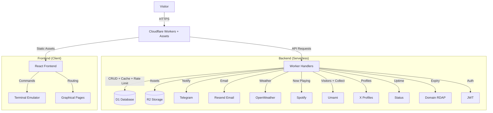
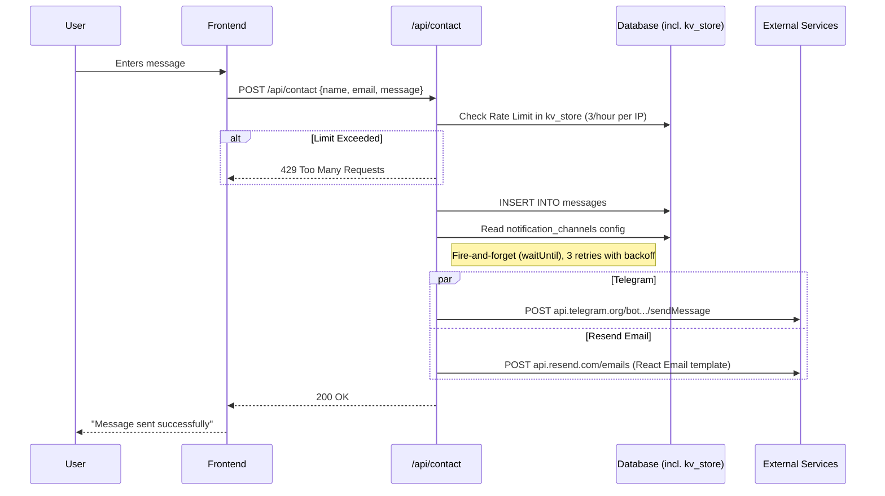
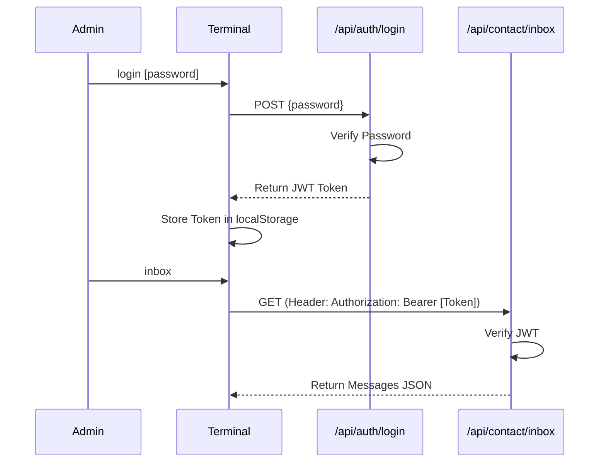

# System Architecture

## Overview

Neosphere (bweb) is a full-stack application built on Cloudflare Workers with static assets. It combines a React-based frontend that mimics a terminal interface with backend functionality provided by a single Worker (`worker/index.ts`).

## High-Level Diagram

## Data Flow: Contact Form

When a user submits a message via the `/contact` page or `contact` command:

## Authentication

Authentication is used for administrative tasks (viewing messages, configuring settings).

## Database Schema

The application uses Cloudflare D1 (SQLite) for persistence.

### Tables

1. **notes**: Visitor guestbook entries (mock file system).
   - `id`, `filename`, `content`, `ip`, `timestamp`

2. **messages**: Contact form submissions.
   - `id`, `name`, `email`, `message`, `ip`, `user_agent`, `timestamp`, `read`

3. **config**: Key-value store for site settings.
   - `key` (PK), `value`

4. **public**: Terminal `public_fs` filesystem (files + directories).
   - `path` (PK), `type`, `content`, `size`, `author`, `updated_at`

5. **ai_queries**: AI chat log + per-IP quota (5 for guests, unlimited for admins).
   - `id` (PK), `ip`, `prompt`, `response`, `model`, `cost`, `prompt_tokens`, `completion_tokens`, `is_admin`, `created_at`

6. **kv_store**: D1-backed drop-in for the former KV namespace (see below).
   - `key` (PK), `value`, `expires_at` (0 = never expires; self-created on first use)

### Hot Cache + Rate Limits (`kv_store` in D1, via `worker/lib/d1-kv.ts`)

KV allows 1,000 writes/day on the Workers Free plan; the per-minute cron pattern (locks + caches + deletes across three jobs) burns ~7–10k/day. D1 allows 100,000 rows written + 5M read/day, so the exact same access pattern fits with ~10x headroom. Same keys, same TTLs, same lock/dedup behavior — only the backend moved. TTL is emulated with `expires_at` (D1 has no native key expiry). The `RATE_LIMITER` KV binding is still declared but only feeds the `/api/health` probe.

- **Rate limits**: sliding-window counters (`login:<ip>`, `contact:<ip>`, `create_note:<ip>`, …). Approximate under concurrency (no atomic incr) — acceptable for abuse throttles.
- **Music cache**: `cache:spotify:currently_playing` (60s TTL playing / 120s TTL idle; 15s fresh window when playing, 60s when idle) + `cache:spotify:last_played` (30d TTL) for history fallback. Upstream failures write a short cooldown marker (`cache:spotify:upstream_cooldown`, honors `Retry-After` up to 300s) so a sick proxy causes a trickle, not a retry storm.
- **Visitors cache**: `cache:visitors:v1` (120s TTL, 30s fresh window) + revalidation lock (60s TTL).
- **Status cache**: `cache:status:v1` (120s TTL, 30s fresh window) + revalidation lock (60s TTL).
- **Alert state**: Spotify re-auth and domain-expiry milestone machines (`pending/sent/failed` per cycle) + revalidation locks (60s TTL).

### Object Storage (R2)

- **neosphere-assets**: Stores gallery images and other static media.
  - Accessed via `worker/routes/gallery.ts` (Listing/mutations) and `/gallery/*` (Serving).
  - Accessed via `/media/*` (Raw asset serving).

## Key Components

### Frontend
- **Terminal Component**: Handles command parsing, history, and "filesystem" navigation.
- **Commands System**: Modular command definitions (`ls`, `cat`, `login`, `alerts`) in `src/utils/commands.tsx`.
- **Graphical Pages**: Full-screen React components overlaying the terminal (Gallery, About, Contact).

### Backend (Worker)
- **Tech**: Cloudflare Workers (native fetch + scheduled handler, no framework).
- **Location**: `/worker/index.ts` (router) + `/worker/routes/*` (handlers) + `/worker/lib/*` (shared helpers).
- **Routing**: Explicit pathname routing.
  - `worker/routes/contact.ts`: Public contact endpoint.
  - `worker/routes/contact.ts` (`handleInbox`): Protected message retrieval.
  - `worker/routes/auth-admin.ts` (`handleAdminConfig`): Configuration management.

## Performance & Security

### Rate Limiting
To prevent abuse, sensitive endpoints (`/api/contact`, `/api/auth/login`) are protected by a custom rate limiter backed by the D1 `kv_store` table.
- **Strategy**: Variable window counters (Sliding Window approximation).
- **Limits**:
  - Login: 5 attempts / 60s per IP.
  - Contact: 3 messages / hour per IP.

### Image Optimization
Gallery images stored in R2 are optimized on-the-fly using **Cloudflare Image Resizing**.
- **Frontend**: `src/utils/imageOptimizer.ts` rewrites R2 URLs to `/cdn-cgi/image/...`.
- **Backend**: Cloudflare Edge handles resizing, format conversion (WebP/AVIF), and caching.
- **UX**: Images are lazy-loaded (`loading="lazy"`) and preloaded in the lightbox for instant navigation.

## Background Jobs & Caching

One Worker, two cron schedules (dispatched on `controller.cron` in `worker/index.ts`):

| Schedule | Job |
| :--- | :--- |
| `* * * * *` | Refreshes the D1 playback + visitors + status caches and runs Spotify re-auth milestone checks (30/20/10/5/1 days, lock-deduped per cycle). |
| `30 6 * * *` | RDAP expiry check for `MONITORED_DOMAINS` with milestone emails (30/20/10/5/2/1 days, D1-deduped per domain + expiry cycle). |

### Music Playback Pipeline (`worker/routes/music.ts`)

Pull-based with stale-while-revalidate:

1. **HIT** (playing < 15s, or idle < 60s) → served instantly, no upstream call. Idle HITs serve last-played history when present.
2. **STALE** (expired) → served instantly + one background revalidation (lock key dedups concurrent stampedes).
3. **MISS** → inline upstream fetch (skipped while the failure cooldown is active), response served immediately; cache + last-played history persist in the background (`waitUntil`).
4. **Idle** → authoritative `is_playing:false` snapshots are cached like playing ones, so idle polling costs ~1 upstream req/min flat; failures back off 60s+ instead of retrying per poll. Last-played history if present, else bare `{is_playing: false}`.

Upstream load stays at ~1–4 req/min regardless of visitor count. Frontend polls every 30s (visible tabs only) and projects progress client-side, so typical display lag is 15–45s. Alert emails (Spotify + domains) are Resend-idempotent per milestone + cycle, so retries never double-send.

### Visitors Pipeline (`worker/routes/visitors.ts`)

Same SWR shape: HIT (<30s) → instant; STALE → instant + one locked background refresh; MISS → inline Umami `stats` + `active` fetch, response served immediately while the cache persists in the background (`waitUntil`). Cron-warmed, so upstream stays at ~1 fetch/min. Frontend (`useVisitors` + `VisitorCounter`) polls every 30s (visible tabs only); the pill shows total always, live count only when >0.
