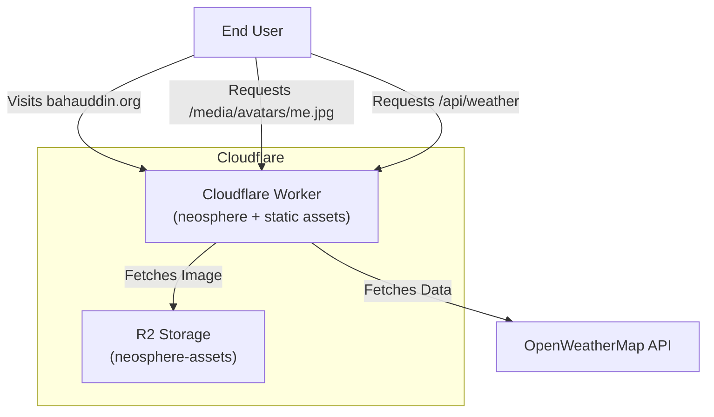

# Neosphere Project Workflow 

This document explains how the **Neosphere** project is built, deployed, and how its different parts (Cloudflare Workers, static assets, R2) fit together.

## 1. High-Level Architecture

The project is a **full-stack Worker**: a React/Vite SPA served as static assets, plus a native Worker (`worker/index.ts`) handling API routes, R2 media serving, and SEO pages.



### Key Components
1.  **Static Assets (Frontend)**:
    -   Hosts the static files built by Vite (`index.html`, JS bundles, CSS) from `dist/`.
    -   Served by Cloudflare with edge caching; SPA fallback via `not_found_handling`.
    
2.  **Worker (Backend)**:
    -   Single entry `worker/index.ts` with explicit routing (`worker/routes/*`, shared code in `worker/lib/*`, no framework).
    -   **Usage**:
        -   `/media/*`, `/assets/*`, `/gallery/*`: R2 object serving (streamed, immutable cache headers).
        -   `/api/*`: Secure API calls without exposing keys to the frontend.
        -   SEO pages (`/about`, `/contact`, `/projects`, `/notes`, `/gallery/*`, `/shared/notes/*`) via HTMLRewriter.

3.  **Cloudflare R2 (Storage)**:
    -   Stores large media files (images, videos) to keep the Git repository light.
    -   **Bucket Name**: `neosphere-assets`
    -   **Access**: We don't expose the bucket directly. Instead, the Worker securely fetches files and serves them.

---

## 2. Workers + Static Assets Model

**Architecture:** one Worker serves the Vite `dist/` assets and all dynamic routes.

-   **Static assets**: Vite build output (`dist/`) uploads with the Worker and serves from the edge (`not_found_handling: single-page-application`).
-   **Worker**: `worker/index.ts` handles API routes, R2 serving, and SEO injection, with selective `run_worker_first` routing (see `wrangler.jsonc`).
-   **Scheduled jobs** (same Worker, dispatched on `controller.cron`):

    | Schedule | Job |
    | :--- | :--- |
    | `* * * * *` | In-process Spotify revalidation: refreshes KV playback cache + runs Spotify re-auth checks |
    | `30 6 * * *` | RDAP domain-expiry check for `MONITORED_DOMAINS` + emails |

---

## 3. The Deployment Workflow (CI/CD)

We use **GitHub Actions** to automate the deployment. You simply push code, and the system handles the rest.

```mermaid
sequenceDiagram
    participant Dev as You (Developer)
    participant GitHub as GitHub Repo
    participant Action as GitHub Action (CI/CD)
    participant CF as Cloudflare Workers

    Dev->>GitHub: git push origin main
    GitHub->>Action: Trigger 'deploy.yml'
    
    rect rgb(30, 30, 30)
        note right of Action: Build Process
        Action->>Action: Checkout Code
        Action->>Action: Install Dependencies (pnpm install)
        Action->>Action: Build Site (pnpm build) -> /dist
    end

    Action->>CF: Deploy Worker + assets (wrangler deploy)
    CF-->>Action: Deployment Success (URL)
    Action-->>GitHub: Update Status (Green Checkmark)
```



### Steps in Detail:
1.  **Push**: You commit and push changes to `main`.
    -   *Note*: The workflow **will not run** if you only change `.md` files or the `docs/` folder.
2.  **Trigger**: The `.github/workflows/deploy.yml` file detects the push and starts a runner (Ubuntu VM).
3.  **Build**:
    -   It installs `npm` packages.
    -   It runs `pnpm build` to create the static files in `dist/`.
4.  **Deploy**:
    -   It uses `wrangler-action` to authenticate with Cloudflare (using your secrets).
    -   It runs `wrangler deploy`, uploading the `dist/` folder and the `worker/index.ts` Worker as a single unit.
    -   Cloudflare spins up the new version of the site globally.

---

## 4. How R2 Integration Works

We needed a way to serve images without bloating the repo. Here is the flow:

1.  **Storage**: We created a bucket `neosphere-assets`.
2.  **Binding**: In `wrangler.jsonc`, we give the Worker access to this bucket under the name `neosphere_assets`.
3.  **Proxying**:
    -   `worker/index.ts` routes `/media/*` to `handleMedia` (`worker/routes/pages-assets.ts`).
    -   The trailing path is the R2 key: `/media/gallery/photo1.jpg` serves key `gallery/photo1.jpg`, streamed back to the user.
    
**Why do this?**
-   **Security**: You can add authentication later easily.
-   **Performance**: Cloudflare caches the images at the edge.
-   **Simplicity**: Your frontend just uses normal `` tags: ``.

---

## 5. Required Secrets

For this to work, your GitHub Repository needs these secrets (Settings > Secrets > Actions):

| Secret Name | Description | Source |
| :--- | :--- | :--- |
| `CLOUDFLARE_API_TOKEN` | Allows GitHub to talk to Cloudflare | Cloudflare Dashboard (User Profile > API Tokens) |
| `CLOUDFLARE_ACCOUNT_ID` | Identifies your account | Cloudflare Dashboard URL |

Non-secret config (`SPOTIFY_API_URL`, `X_API_URL`) lives in `wrangler.jsonc` `vars`. Everything else is a Worker secret — upload all at once (see README for the file shape):

```bash
pnpm exec wrangler secret bulk /path/to/secrets.json
pnpm exec wrangler secret list   # verify
```

| Secret | Purpose | Required? |
| :--- | :--- | :--- |
| `ADMIN_PASSWORD` | Terminal `login` | Yes |
| `JWT_SECRET` | Token signing (falls back to `ADMIN_PASSWORD`) | No |
| `TELEGRAM_BOT_TOKEN` / `TELEGRAM_CHAT_ID` | Contact notifications | For Telegram alerts |
| `RESEND_API_KEY` / `CONTACT_EMAIL_TO` / `CONTACT_EMAIL_FROM` | Email notifications + expiry alerts | For email alerts |
| `OPENWEATHER_API_KEY` | `weather` command (simulated fallback without) | No |
| `OPENROUTER_API_KEY` | AI chat | For `/api/ai` |
| `STATUS_API_KEY` | Server status proxy | For `/api/status` |
| `SPOTIFY_API_KEY` | Now-playing proxy auth | For `/api/music` live data |
| `MONITORED_DOMAINS` | Comma-separated domains for expiry checks | For domain alerts |

Local dev reads `.dev.vars` (see `.dev.vars.example`). Secrets never go in `wrangler.jsonc` — a same-named secret silently shadows the `vars` value.
